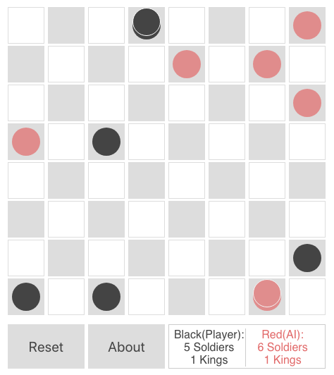

# React Checkers
Built a checkers AI computer games using react. I know that the title says 'React Checkers', but there isn't a ton of React in use here, it's only handling the display (that's its job, huh?). Essentially React displays our board array, and most of the moving and detection are just accessing that array. The AI is built out using a limited version of the minimax algorithm (see http://neverstopbuilding.com/minimax for a nice explanation of what that means), simply it means that the program forecasts futures, assumes you'll play as if you were doing the same, and picks the route that it thinks will result in the best for itself if you also play 'perfeclty', and I use that word loosely because this AI currently only looks 3 turns in to the future. It uses a point system to determine 'good' and 'bad' stuff that could happen, for example, if it can win in the next 3 turns, thats a 100 point outcome. If it will lose in the next 3 turns, thats worth -100 points, losing a king or killing an enemy king are worth -25 or 25 points respectively, and killing/losing regular pieces are worth +-10 points. Lastly, classifies making a new king of it's own as worth 15 points, so slightly better than killing 1 opponent. The bot looks through something like 1000-1500 possible futures before each move.

## Rules of the game
<ul>
  <li>Moves are allowed only on the dark squares, so pieces always move diagonally. Single pieces are always limited to forward moves (toward the opponent).</li>
  <li>A piece making a non-capturing move (not involving a jump) may move only one square.</li>
  <li>A piece making a capturing move (a jump) leaps over one of the opponent's pieces, landing in a straight diagonal line on the other side. Only one piece may be captured in a single jump; however, multiple jumps are allowed during a single turn.</li>
  <li>When a piece is captured, it is removed from the board.</li>
  <li>If a player is able to make a capture, there is no option; the jump must be made. If more than one capture is available, the player is free to choose whichever he or she prefers.</li>
  <li>When a piece reaches the furthest row from the player who controls that piece, it is crowned and becomes a king. One of the pieces which had been captured is placed on top of the king so that it is twice as high as a single piece.</li>
  <li>Kings are limited to moving diagonally but may move both forward and backward. (Remember that single pieces, i.e. non-kings, are always limited to forward moves.)</li>
  <li>Kings may combine jumps in several directions, forward and backward, on the same turn. Single pieces may shift direction diagonally during a multiple capture turn, but must always jump forward (toward the opponent).</li>
</ul>

## Installation abd use

```
$ git clone git@github.com:amirphp7/checkers-twisker.git
```
```
$ cd checkers-twisker
```
```
$ yarn install
```
```
$ yarn start
```
** http://localhost:3000

## Screenshots


